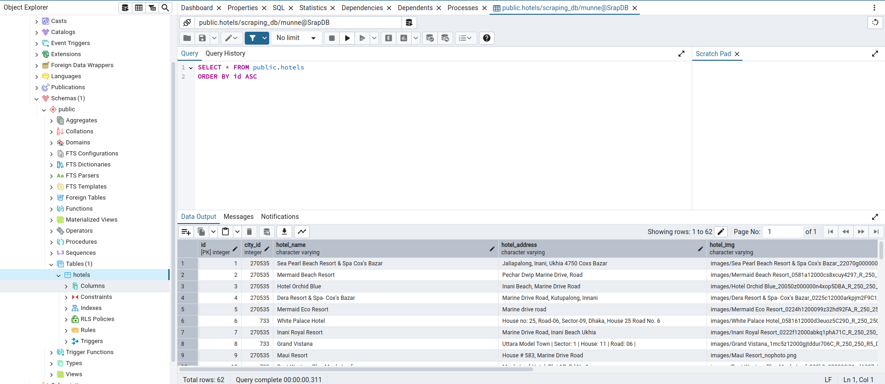

# Scraping trip.com Website 

## Project Overview
The project is designed to scrape property information from **trip.com** and store it in a **PostgreSQL** database using **SQLAlchemy**. The goal of this project is to gather essential property details such as title, rating, location, latitude, longitude, room type, price, and images from the trip.com website. The collected data is dynamically stored and retrievable, making the system functional and adaptable.

## Table of Contents

- [Features](#features)
- [Project Structure](#project-structure)
- [Getting Started](#getting-started)
- [Code Coverage](#code-coverage)
- [Contributing](#contributing)

## Features
### Scraping Data
It scraps data form trip.com. First, it randomly choices lactions between worldwide and Bangladesh. Then, the project selects 3 locations to scrape its information (property title, rating, location, latitude, longitude, room type, price and hotel image). 

### Storing Images
Images will be automatically downloaded and stored in a directory called `images`. The image file names will be stored as references in the database for later use.


### Storing Data in PostgreSQL
The scraper will automatically create the necessary database table and store hotel property data such as city_id, title as hotel name, rating, location, latitude, longitude, room type, price, and image references.

### View data in pgAdmin
You can view stored scraped data through pgadmin

### Testing
Testcase are written for scrapper file, pipelines, models and items. Test coverage is 87%.

## Project Structure

The project follows a standard Scrapy project structure. Here’s an overview:


```plaintext
scrapingcourse_scraper/
├── .coveragerc
├── docker-compose.yml
├── Dockerfile
├── run_tests.py
├── requirements.txt
├── tests/
│   ├── __init__.py
│   ├── test_spider.py
│   ├── test_pipelines.py
│   ├── test_items.py
│   ├── test_middlewares.py
│   └── test_models.py
└── scrapingcourse_scraper/
    ├── __init__.py
    ├── items.py
    ├── middlewares.py
    ├── pipelines.py
    ├── models.py
    ├── settings.py
    └── spiders/
        ├── __init__.py
        └── scraper.py
```
- **scrapingcourse_scraper/spiders/scraper.py:** Contains the Scrapy spider that scrapes hotel information.

- **scrapingcourse_scraper/items.py:** Defines fields for storing property details including city ID, hotel name, address, image, price, rating, room type, latitude, and longitude.

- **scrapingcourse_scraper/models.py:** Defines an SQLAlchemy model for a hotel database, with fields for hotel details, and includes a function to create the database engine and session for interacting with it.

- **scrapingcourse_scraper/pipelines.py:** Defines a Scrapy pipeline that processes scraped hotel items, saves hotel data to a PostgreSQL database using SQLAlchemy, and stores hotel images locally, referencing their paths in the database.

- **settings.py:** Configures Scrapy settings, including database connection and other spider settings.

- **Dockerfile:** Defines the Docker container for the scraper.

- **docker-compose.yml:** Configures Docker containers for both the Scrapy scraper and PostgreSQL database.

## Getting Started

### Prerequisites

Before running this project, ensure you have the following installed:

- **Python 3x** (for local development)
- **Git** (for version control)
- **Docker and Docker Compose**
   - Follow the official Docker installation guide to install Docker on your system: [Docker Installation Guide](https://docs.docker.com/desktop/)


### Installation

1. Clone the repository

   ```bash
   git clone https://github.com/Khairun-Nahar-Munne/Scrapy.git
   cd Scrapy
   ```
2. Set Up a Virtual Environment

   On Linux/macOS:

    ```bash
    python3 -m venv env  # or python -m venv env 
    source env/bin/activate
    ```
   On Windows:

    ```bash
    python3 -m venv env   # or python -m venv venv 
    env\Scripts\activate
    ```
3. Install depedencies

    ```bash
    cd scrapingcourse_scraper
    pip install -r requirements.txt
    ```

### Running Application
- Ensure Docker Desktop is running on your system, as it is required to manage the containers. Then, execute the following commands to build and run the application in therminal (Scrapy/scrapingcourse_scraper) :

   ```bash 
    docker-compose build
    docker-compose up
   ```
   
 - If you face any issue during building docker, you can stop the docker container (press `Ctrl + C`), run docker container down command and again up the docker container for running.
   ```bash
    docker-compose down
    docker-compose up
   ```

### Viewing Database Tables in the Docker Container
You can view database in two ways through terminal pgAdmin. You have to keep the docker-container running to view database.

- To view data from pgAdmin:
   
   1. Set Up pgAdmin
   

      ```
      - Launch pgAdmin on http://localhost:5050 in your browser.

      - Provide Admin Email: admin@admin.com and Password: admin123

      - Right-click on "Servers" > Click on "Register" > "Server" > Fill up the details > Save.

      - Fill up the details:

         General Tab:
         Name your connection: ScrapDB

         Connection Tab:
         Host: postgres
         Port: 5432 
         Maintenance Database: postgres.
         Username: munne
         Password: munne123

      ```
   2. Click on Server > ScrapDB > scraping_db> Schemas > Tables > hotels
   3. Right click on hotles > View/Edit Data> All Rows.

   This will display all the records stored in the `hotels` table.

   


- To inspect the database tables from terminal and view their data within the PostgreSQL container, follow these steps:

   1. Access the PostgreSQL Container
      Run the following command to open a bash shell inside the running database container:
      
      ```bash
      docker exec -it postgresDB_container bash
      ```
   2. Connect to the PostgreSQL Database
      ```bash
      psql -U munne -d scraping_db
      \c scraping_db
      ```
   3. Query the Database
   To view the data in the `hotels` table, execute the following SQL command:

      ```bash
      SELECT * FROM public.hotels;
      ```
      This will display all the records stored in the `hotels` table.
 


## Code Coverage

This can be tested using:

   ```bash
   python3 run_tests.py
   ```
 You can also see code coverage in the terminal.

 **Notice**: 

 You can notice thate there are two meassages like Error saving image and No data found in 'outboundCities'. These expected and does not indicate a problem with the application.
 
 Error saving image message is shown beacause the test ensures that if requests.get raises a RequestException while attempting to save an image, the save_image method returns None to handle the error gracefully. 
 
 No data found in 'outboundCities' is shown beacause the test ensures that if there is no data for selected sity in the website script , it can handle the error gracefully.


## Contributing

Contributions are welcome! Here's how you can contribute:

### Fork the Repository

```bash
- git clone https://github.com/Khairun-Nahar-Munne/Scrapy.git
- cd Scrapy
```

### Create a New Branch

```bash
- git checkout -b feature/add-new-feature
```

### Make Modifications and Commit Changes

```bash
- git commit -m 'Add new feature: [brief description of the feature]'

```

### Push Changes to the Branch

```bash
- git push origin feature/add-new-feature

```

### Create a New Pull Request

- Navigate to the repository on GitHub.
- Click on the "Compare & pull request" button.
- Fill in the pull request details and submit it for review.